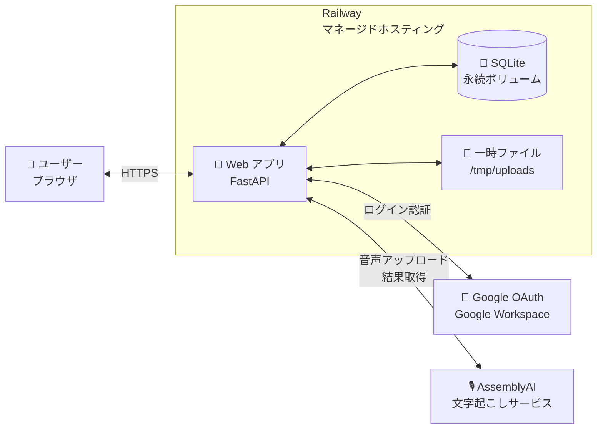
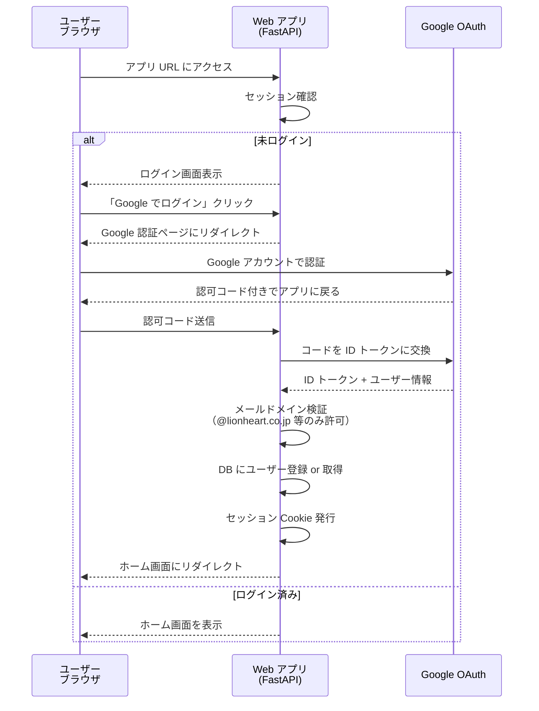
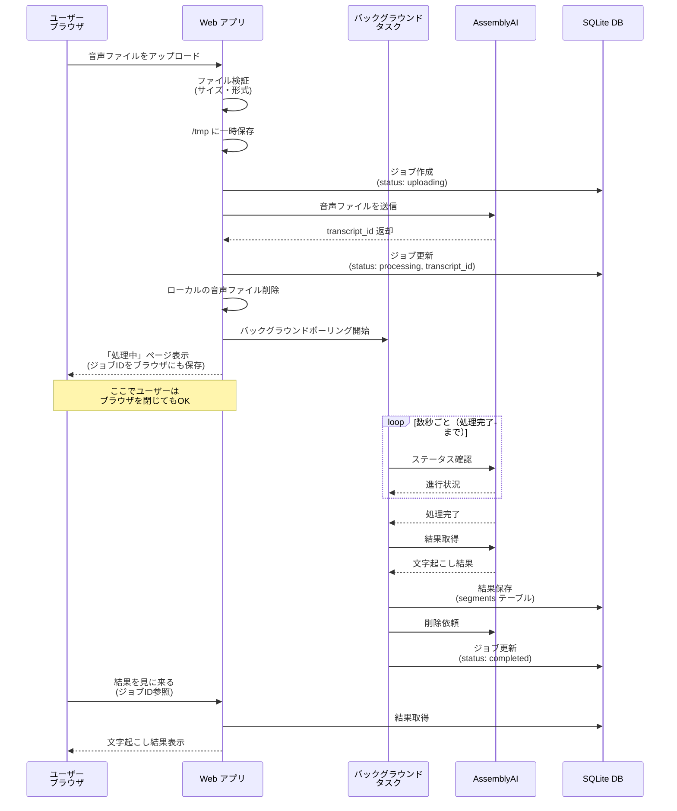
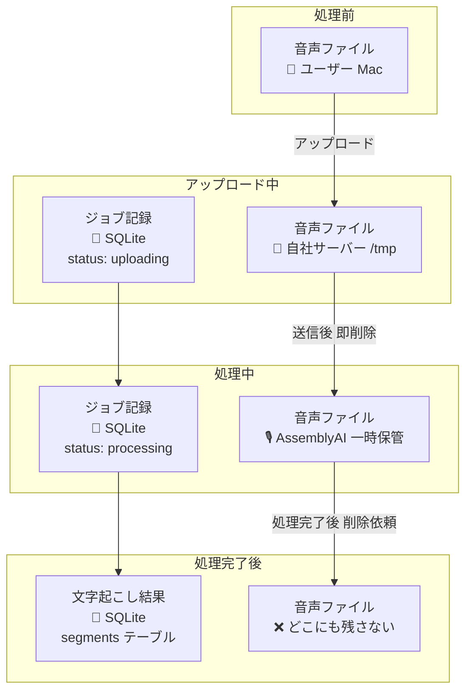
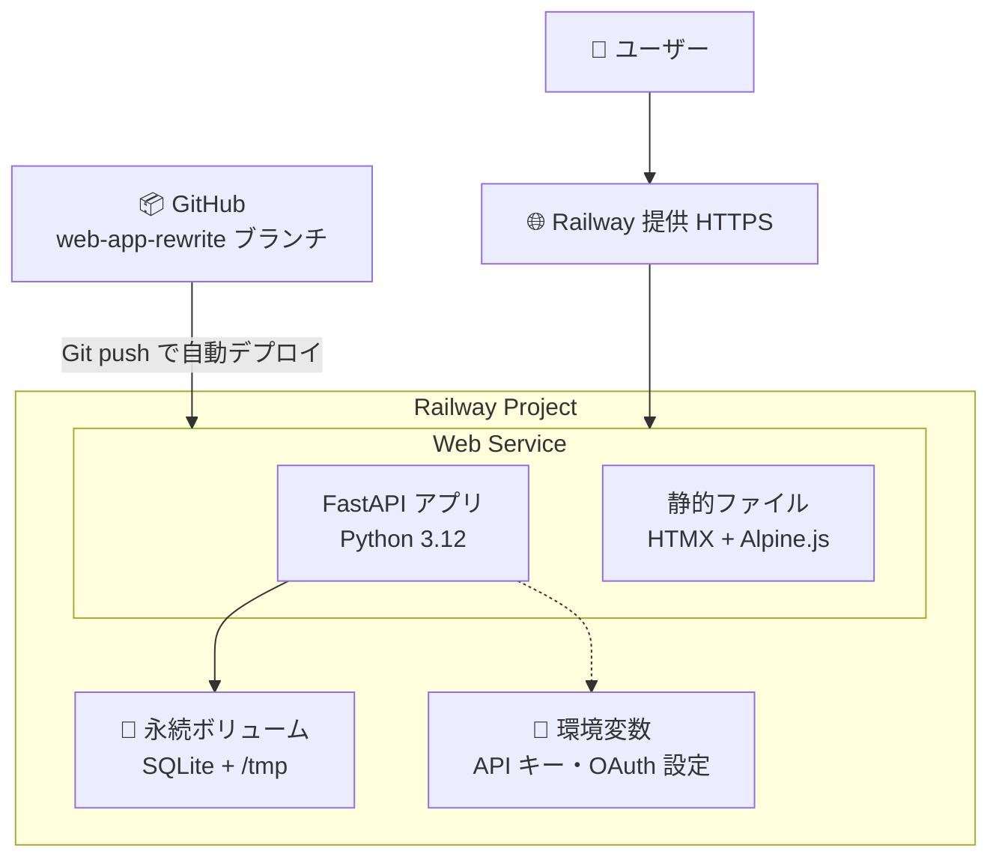

# システムアーキテクチャ（ARCHITECTURE.md）

このファイルは Web アプリ版のシステム構成を視覚化したものです。  
コードに入る前に「どう動くか」の地図として参照します。

最終更新: 2026-05-12

---

## 1. システム全体図



### コンポーネントの責務

| コンポーネント | 役割 |
|---|---|
| **ブラウザ（ユーザー）** | UI 表示、ファイル選択、結果閲覧・編集 |
| **Web アプリ（FastAPI）** | リクエスト処理、認証、AssemblyAI 連携、データ永続化 |
| **SQLite DB** | ユーザー情報、ジョブ状態、文字起こし結果、話者名履歴を保存 |
| **一時ファイル領域** | アップロード中の音声ファイルを一時保存（処理後即削除） |
| **Google OAuth** | ユーザー認証（社内ドメイン限定） |
| **AssemblyAI** | 文字起こし＋話者分離の実処理 |

---

## 2. 認証フロー（Google OAuth）



### 認証の重要な決定事項

- **ドメイン制限**: ID トークンの `email` フィールドを検証し、許可ドメイン以外は弾く
- **セッション管理**: HttpOnly Cookie + Secure 属性（HTTPS 必須）
- **退職者対応**: Google Workspace 側でアカウント停止すれば、即座にログイン不可になる
- **ログアウト**: セッション Cookie を削除（Google 側のログアウトは強制しない）

---

## 3. 文字起こし処理フロー（非同期）



### 重要な設計ポイント

1. **完全非同期（E-1 方針）**  
   ユーザーがブラウザを閉じても、バックグラウンドタスクが処理を継続する。  
   AssemblyAI 側で結果が完成してから、ユーザーがブラウザを開き直しても結果を取得できる。

2. **ファイル保持の最小化（A-4 方針）**  
   音声ファイルは：
   - 自社サーバー（/tmp）: AssemblyAI に送り終わったら即削除
   - AssemblyAI: 処理完了後に即削除依頼
   - 永続保存される音声データはどこにもない

3. **結果はサーバー DB に保存**  
   文字起こしの「結果（テキスト＋話者）」のみが SQLite に永続化される。  
   ユーザーはいつでも、どのブラウザからでも結果を見られる。

4. **バックグラウンドタスクの実現方式**  
   FastAPI の `BackgroundTasks` または `asyncio.create_task` を使用。  
   Celery のようなジョブキューは不要（規模が小さいため）。  
   サーバー再起動時に未完了ジョブをどう扱うかは要設計（DB に状態保存しておけば再開可能）。

---

## 4. データの所在マップ

「いつ・どこに・どのデータがあるか」を整理：



### プライバシー保証

- 音声ファイル: **処理完了後 24時間以内** にすべてのサーバーから消える
- AssemblyAI への削除依頼が失敗した場合のフェイルセーフを実装する（再試行ロジック）
- 結果テキストは DB に残るが、ユーザーが削除すれば即消去

---

## 5. デプロイ構成（Railway）



### Railway 上での運用

- **デプロイ**: GitHub の `web-app-rewrite` ブランチに push すれば自動でビルド＆デプロイ
- **環境変数**: AssemblyAI API キー、Google OAuth 設定、セッションシークレットなどを管理画面で設定
- **永続ボリューム**: SQLite ファイルと一時ファイル領域を保持（再デプロイで消えない）
- **HTTPS**: Railway が自動で SSL 証明書を発行・更新（手動作業不要）
- **ドメイン**: 初期は `*.railway.app` の自動ドメイン、必要なら独自ドメイン設定可能
- **ログ・監視**: 管理画面でリアルタイムログが見られる

---

## 6. ファイルレベルの構成（コードの整理）

実装時のディレクトリ構成（暫定）：

```
transcription/
├── CLAUDE.md
├── docs/                       ← 設計ドキュメント群
│   ├── ARCHITECTURE.md
│   ├── DESIGN.md
│   ├── DECISIONS.md
│   ├── ROADMAP.md
│   ├── CHANGELOG.md
│   ├── RISKS.md
│   ├── DATA_MODEL.md           ← 次のセッションで作成
│   ├── API.md                   ← 次のセッションで作成
│   └── SECURITY.md              ← 次のセッションで作成
├── backend/                    ← FastAPI のコード
│   ├── main.py                 ← FastAPI エントリポイント
│   ├── config.py               ← 設定読み込み（環境変数）
│   ├── auth/                   ← Google OAuth 関連
│   │   ├── routes.py
│   │   └── google.py
│   ├── transcribe/             ← 文字起こし関連
│   │   ├── routes.py
│   │   ├── assemblyai_client.py
│   │   └── tasks.py            ← バックグラウンドタスク
│   ├── db/                     ← データベース層
│   │   ├── models.py           ← SQLAlchemy モデル
│   │   ├── session.py
│   │   └── migrations/
│   └── static/                 ← フロントエンド静的ファイル
│       ├── index.html
│       ├── css/
│       └── js/
├── tests/                      ← テスト
└── pyproject.toml              ← Python 依存関係定義
```

### 設計上の原則

- **1ファイル 500行以内** を目安に分割（旧 app.py の 2,191行 への反省）
- **機能ごとにフォルダ**（auth/, transcribe/, db/）
- **ルーティング・ロジック・DB アクセスを分離**

---

## 7. このアーキテクチャの根拠

### なぜこの構成？

| 設計判断 | 根拠 |
|---|---|
| Web アプリ化 | 場所に縛られない作業を実現するため（DECISIONS.md 参照） |
| FastAPI | 非同期処理・型安全性・Claude Code との相性 |
| SQLite | 5〜8人規模では十分。運用がシンプル |
| HTMX + Alpine | SPA は過剰。ビルドツール不要 |
| Railway | デプロイの容易さ、Git 連携、永続ボリューム |
| Google OAuth | 既に Google Workspace を使用、退職者対応も統合 |
| 非同期処理（E-1） | 中断時にも結果を失わない、Notta 的メンタルモデル |

### このアーキテクチャの限界（将来課題）

- **垂直スケール限界**: SQLite の writer lock により、100人を超える同時利用は要再設計
- **マルチリージョン**: Railway は単一リージョン運用が前提
- **大規模ファイル**: 2GB を超える音声は別アプローチが必要
- **オフライン対応**: 設計上不可（必要なら別アーキテクチャ）

これらの限界に当たったら、Postgres + 別ホスティング + ジョブキューを検討する。
