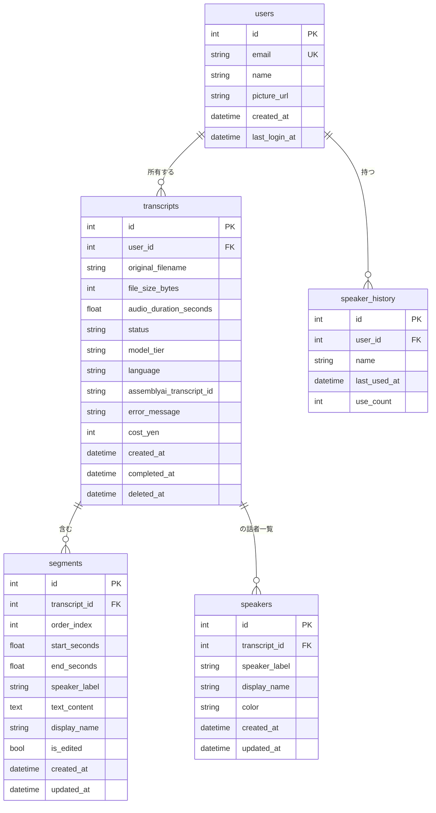

# データモデル（DATA_MODEL.md）

このファイルは SQLite データベースのスキーマ定義です。  
実装時は SQLAlchemy（Python の ORM）を使ってこの定義に対応するモデルクラスを作成します。

最終更新: 2026-05-12

---

## 1. ER 図（テーブル関係）



---

## 2. テーブル詳細

### 2.1 `users` — ユーザー（Google 認証済み社員）

| カラム | 型 | 制約 | 説明 |
|---|---|---|---|
| `id` | INTEGER | PK, AUTOINCREMENT | 内部 ID |
| `email` | TEXT | NOT NULL, UNIQUE | Google アカウントのメール（社内ドメイン） |
| `name` | TEXT | NOT NULL | Google プロフィールの表示名 |
| `picture_url` | TEXT | NULL 許可 | Google プロフィール画像 URL |
| `created_at` | DATETIME | NOT NULL, DEFAULT NOW | アカウント作成日時 |
| `last_login_at` | DATETIME | NOT NULL, DEFAULT NOW | 最終ログイン日時 |

**インデックス**:
- `email` に UNIQUE INDEX（既存ログイン時の検索）

**用途**:
- 初回ログイン時にレコード作成
- 以降のログインで `last_login_at` を更新
- `transcripts.user_id` の参照元

---

### 2.2 `transcripts` — 文字起こしジョブ

1音声ファイル＝1レコード。アップロードからジョブ完了・削除までの状態を持つ。

| カラム | 型 | 制約 | 説明 |
|---|---|---|---|
| `id` | INTEGER | PK, AUTOINCREMENT | ジョブ ID |
| `user_id` | INTEGER | NOT NULL, FK → users.id | 投入したユーザー |
| `original_filename` | TEXT | NOT NULL | アップロード元のファイル名 |
| `file_size_bytes` | INTEGER | NOT NULL | ファイルサイズ |
| `audio_duration_seconds` | REAL | NULL 許可 | 音声の長さ（AssemblyAI が返した値）|
| `status` | TEXT | NOT NULL | 後述のステータス列挙 |
| `model_tier` | TEXT | NOT NULL | `best` または `nano` |
| `language` | TEXT | NOT NULL, DEFAULT `'ja'` | 言語コード |
| `assemblyai_transcript_id` | TEXT | NULL 許可 | AssemblyAI のジョブ ID |
| `error_message` | TEXT | NULL 許可 | 失敗時のメッセージ |
| `cost_yen` | INTEGER | NULL 許可 | 完了時の概算料金（円） |
| `created_at` | DATETIME | NOT NULL, DEFAULT NOW | ジョブ作成日時 |
| `completed_at` | DATETIME | NULL 許可 | 処理完了日時 |
| `deleted_at` | DATETIME | NULL 許可 | ソフト削除日時（NULL = 有効） |

**ステータス列挙**:
- `uploading` — アップロード中
- `processing` — AssemblyAI で処理中
- `completed` — 完了、結果あり
- `failed` — 失敗
- `deleted` — ソフト削除済み（一覧から非表示、ハードDeleteまでの猶予）

**インデックス**:
- `user_id` に INDEX（ユーザー別一覧）
- `created_at DESC` に INDEX（時系列一覧）
- `status` に INDEX（実行中ジョブの検索）
- `(user_id, deleted_at, created_at DESC)` 複合 INDEX（一般的な一覧クエリ用）

**用途**:
- 履歴一覧表示
- 状態監視（処理中のジョブをポーリング）
- 月次累計の集計元

---

### 2.3 `segments` — 文字起こしセグメント

1つの transcript が複数の segments を持つ。発言の単位。

| カラム | 型 | 制約 | 説明 |
|---|---|---|---|
| `id` | INTEGER | PK, AUTOINCREMENT | セグメント ID |
| `transcript_id` | INTEGER | NOT NULL, FK → transcripts.id, ON DELETE CASCADE | 親ジョブ |
| `order_index` | INTEGER | NOT NULL | 表示順序（0始まり） |
| `start_seconds` | REAL | NOT NULL | 開始秒数 |
| `end_seconds` | REAL | NOT NULL | 終了秒数 |
| `speaker_label` | TEXT | NOT NULL | 内部ラベル（例: `SPEAKER_00`） |
| `text_content` | TEXT | NOT NULL | 文字起こしテキスト |
| `display_name` | TEXT | NULL 許可 | 個別の話者名上書き（カード単位編集時） |
| `is_edited` | INTEGER | NOT NULL, DEFAULT 0 | テキストが手動編集されたか（0/1） |
| `created_at` | DATETIME | NOT NULL, DEFAULT NOW | 作成日時 |
| `updated_at` | DATETIME | NOT NULL, DEFAULT NOW | 更新日時 |

**インデックス**:
- `(transcript_id, order_index)` 複合 INDEX（表示用ソート）

**注意点**:
- `display_name` が NULL なら、`speakers` テーブルから話者名を引く（後述）
- カスケード削除: transcript が削除されたら segments も全部削除

---

### 2.4 `speakers` — 話者の表示名マッピング

1つの transcript の中で、内部ラベル（`SPEAKER_00`）に対する表示名（`山田さん`）と色を管理。

| カラム | 型 | 制約 | 説明 |
|---|---|---|---|
| `id` | INTEGER | PK, AUTOINCREMENT | ID |
| `transcript_id` | INTEGER | NOT NULL, FK → transcripts.id, ON DELETE CASCADE | 親ジョブ |
| `speaker_label` | TEXT | NOT NULL | 内部ラベル（例: `SPEAKER_00`） |
| `display_name` | TEXT | NOT NULL | 表示名（例: `山田さん`、または「未設定話者1」） |
| `color` | TEXT | NULL 許可 | UI 表示色（例: `#3B82F6`）。自動生成可 |
| `created_at` | DATETIME | NOT NULL, DEFAULT NOW | 作成日時 |
| `updated_at` | DATETIME | NOT NULL, DEFAULT NOW | 更新日時 |

**インデックス**:
- `(transcript_id, speaker_label)` UNIQUE 複合 INDEX

**表示名の解決ルール（重要）**:
1. 該当 `segment.display_name` が NULL でなければ、それを使う（個別上書き）
2. なければ `speakers.display_name` を使う（一括変更で設定）
3. それもなければ「未設定話者N」を表示（N は初出順）

これにより F-1（Notta 風話者編集）の挙動が実現できる。

---

### 2.5 `speaker_history` — 話者名候補の履歴

ユーザーが過去に付けた話者名をすべて記録し、Notta 風ドロップダウンの候補として使う。

| カラム | 型 | 制約 | 説明 |
|---|---|---|---|
| `id` | INTEGER | PK, AUTOINCREMENT | ID |
| `user_id` | INTEGER | NOT NULL, FK → users.id, ON DELETE CASCADE | ユーザー |
| `name` | TEXT | NOT NULL | 話者名 |
| `last_used_at` | DATETIME | NOT NULL, DEFAULT NOW | 最終使用日時 |
| `use_count` | INTEGER | NOT NULL, DEFAULT 1 | 使用回数 |

**インデックス**:
- `(user_id, name)` UNIQUE 複合 INDEX
- `(user_id, last_used_at DESC)` 複合 INDEX（候補の表示順用）

**用途**:
- 話者編集ドロップダウンの候補リスト
- 同じ名前を再度使ったら `last_used_at` を更新、`use_count` をインクリメント

---

## 3. データ保持ポリシー

| データ | 保持期間 | 削除方法 |
|---|---|---|
| `users` | ユーザーが Google Workspace から無効化されるまで | 退職者対応として要設計 |
| `transcripts`（メタデータ・結果） | **永続**（ユーザーが明示的に削除するまで） | UI から削除 → soft delete → 30日後 hard delete |
| `segments` | transcripts に従う | カスケード削除 |
| `speakers` | transcripts に従う | カスケード削除 |
| `speaker_history` | **永続**（ユーザーがクリアするまで） | 設定画面に削除機能（将来課題） |
| **音声ファイル本体** | **どこにも残さない** | 処理完了後に即削除（A-4 方針） |

### Soft Delete について

- ユーザーが「削除」ボタンを押すと `deleted_at` がセットされる
- 一覧画面では非表示
- 30日以内なら復元可能（誤削除対策）
- 30日経過したら定期バッチでハードDelete（cron 的な仕組みが必要、将来課題）

---

## 4. マイグレーション戦略

### ツール
- **Alembic** を使用（SQLAlchemy 公式マイグレーションツール）

### 運用ルール
- 各スキーマ変更ごとに 1 つのマイグレーションファイル
- マイグレーションファイル名は連番＋日付＋内容
- 例: `001_2026_05_15_create_initial_tables.py`
- 本番デプロイ前に必ずバックアップ（`.sqlite` ファイルのコピー）

### マイグレーション履歴の管理
- `alembic_version` テーブルが自動的に作られる（Alembic が管理）
- DB に適用済みのマイグレーション ID が保存される

---

## 5. 既存ファイルからのインポート（D-1 対応）

Mac アプリ版で作成した `.transcription.json` ファイルを Web 版に取り込むための仕組み。

### 既存フォーマット（v0.1）

```json
{
  "version": 1,
  "current_file": "音声ファイル名.mp3",
  "speaker_names": {
    "SPEAKER_00": "山田さん",
    "SPEAKER_01": "鈴木さん"
  },
  "segments": [
    {
      "start": 0.0,
      "end": 3.5,
      "speaker": "SPEAKER_00",
      "display_name": "",
      "text": "こんにちは。"
    },
    ...
  ]
}
```

### インポート時の変換

1. **transcripts** テーブルに1レコード作成
   - `original_filename` ← `current_file`
   - `status` ← `completed`
   - `assemblyai_transcript_id` ← NULL（AssemblyAI 不使用）
   - その他は適切なデフォルト値
2. **segments** テーブルに各セグメントを INSERT
3. **speakers** テーブルに `speaker_names` を変換して INSERT
4. **speaker_history** に各話者名を加算

→ インポート機能は **フェーズ6（履歴一覧）** で実装予定

---

## 6. SQLite 固有の考慮事項

### 制約と対策

| SQLite の制約 | 影響 | 対策 |
|---|---|---|
| 書き込みは同時1つ | 同時アップロード時に短時間ブロック | WAL モード有効化で読み書き並列性を向上 |
| 一部 ALTER TABLE が制限的 | カラム追加は OK、変更は要工夫 | Alembic で「テーブル再作成」パターンを使う |
| boolean 型がない | 0/1 で表現 | SQLAlchemy が自動変換、特に問題なし |
| 完全な ENUM 型がない | TEXT に CHECK 制約 | アプリケーション側でも検証 |

### パフォーマンス設定

実装時に以下を有効化:

```python
# SQLAlchemy のエンジン作成時に設定
engine = create_engine(
    "sqlite:///./data/app.db",
    connect_args={"check_same_thread": False},
)

# DB 初期化時に実行
with engine.connect() as conn:
    conn.execute(text("PRAGMA journal_mode=WAL;"))     # 並列読み書き
    conn.execute(text("PRAGMA synchronous=NORMAL;"))   # 速度優先
    conn.execute(text("PRAGMA foreign_keys=ON;"))      # FK 制約有効化
```

### バックアップ戦略

- Railway の永続ボリュームは Railway 側でバックアップされる
- 加えて、定期的に `.sqlite` ファイルをコピーするバックアップを実装したい（将来課題）
- 災害復旧テスト: 月1回、バックアップから復元できるか確認（将来課題）

---

## 7. データ量の見積もり

| | 1件あたり | 5〜8人 × 月10時間 × 12ヶ月 | 年間規模 |
|---|---|---|---|
| transcripts | 〜500バイト | 約 500〜1,000件 | 〜500KB |
| segments | 〜200バイト × 平均500件 | 約 250,000〜500,000件 | 〜100MB |
| speakers | 〜100バイト × 平均5件 | 約 2,500〜5,000件 | 〜500KB |
| speaker_history | 〜100バイト × 〜100名 | 約 500〜800件 | 〜80KB |
| **合計（年間）** | | | **約 100MB** |

→ **SQLite で全く問題ない規模**。Railway の標準ボリューム（5GB）に余裕で収まる。

---

## 8. 将来の拡張ポイント

実装後、こんな機能が必要になったら以下のテーブル拡張を検討：

| 機能 | 必要なテーブル変更 |
|---|---|
| 共同編集 | `editors`（transcript_id, user_id, role）テーブル追加 |
| タグ付け | `tags`, `transcript_tags` テーブル追加 |
| フォルダ分類 | `folders` テーブル追加、`transcripts.folder_id` カラム追加 |
| 共有リンク | `share_links`（token, transcript_id, expires_at）テーブル追加 |
| 検索全文 | SQLite FTS5 拡張モジュールを利用 |

これらは v1.0 では実装しない。**「使ってみて欲しくなったら追加」** の方針。
